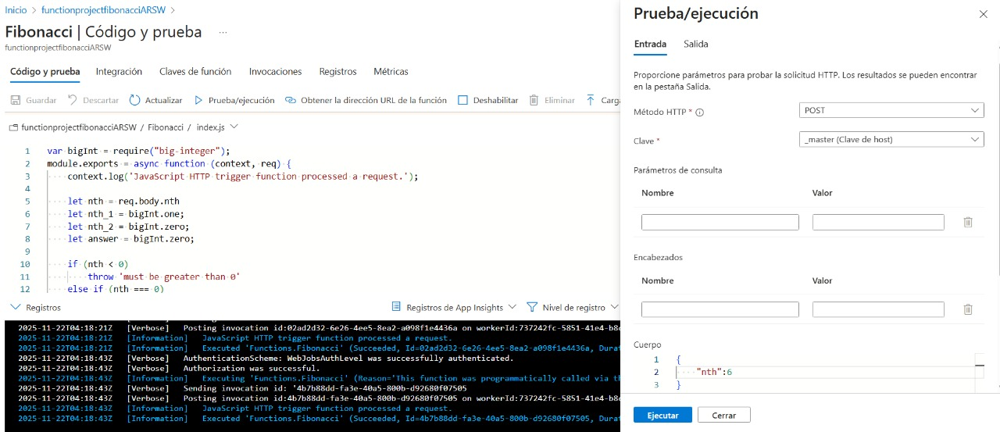
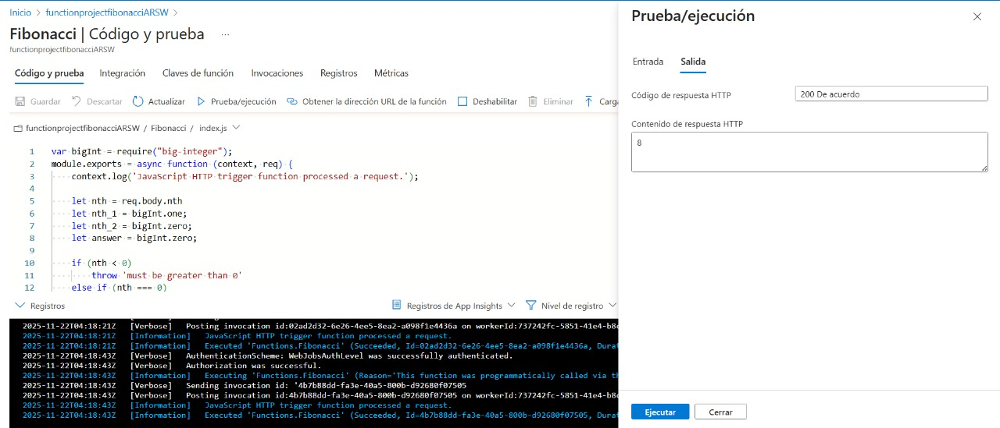
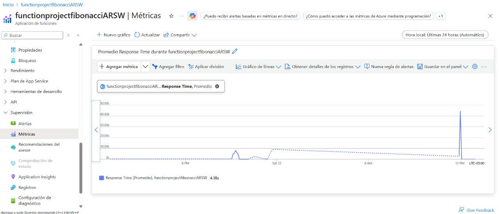
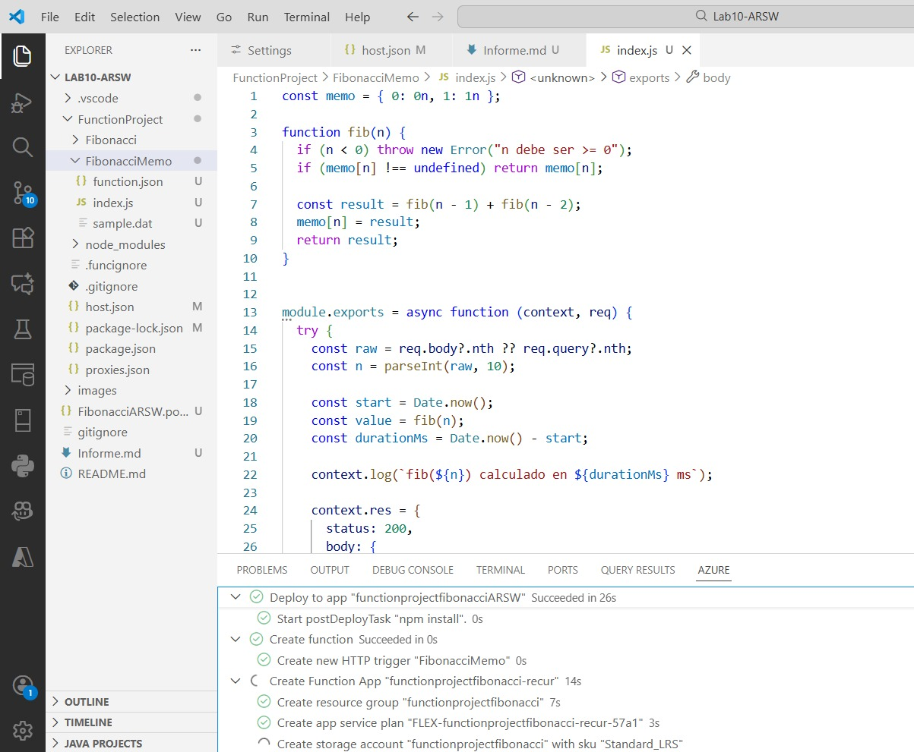
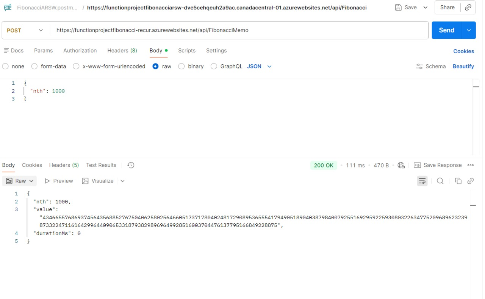

### Escuela Colombiana de Ingeniería
### Arquitecturas de Software - ARSW

## Escalamiento en Azure con Maquinas Virtuales, Sacale Sets y Service Plans
---
## Emily Noreña Cardozo y Haider Andres Rodriguez Maldonado
---
### Dependencias
* Cree una cuenta gratuita dentro de Azure. Para hacerlo puede guiarse de esta [documentación](https://azure.microsoft.com/es-es/free/students/). Al hacerlo usted contará con $100 USD para gastar durante 12 meses.
Antes de iniciar con el laboratorio, revise la siguiente documentación sobre las [Azure Functions](https://www.c-sharpcorner.com/article/an-overview-of-azure-functions/)

### Parte 0 - Entendiendo el escenario de calidad

Adjunto a este laboratorio usted podrá encontrar una aplicación totalmente desarrollada que tiene como objetivo calcular el enésimo valor de la secuencia de Fibonnaci.

**Escalabilidad**
Cuando un conjunto de usuarios consulta un enésimo número (superior a 1000000) de la secuencia de Fibonacci de forma concurrente y el sistema se encuentra bajo condiciones normales de operación, todas las peticiones deben ser respondidas y el consumo de CPU del sistema no puede superar el 70%.

### Escalabilidad Serverless (Functions)

1. Cree una Function App tal cual como se muestra en las  imagenes.

2. Instale la extensión de **Azure Functions** para Visual Studio Code.

3. Despliegue la Function de Fibonacci a Azure usando Visual Studio Code. La primera vez que lo haga se le va a pedir autenticarse, siga las instrucciones.

4. Dirijase al portal de Azure y pruebe la function.

## Solución

Funcionamiento de la función de Fibonacci desde Azure:

Visualización del uso promedio de CPU al realizar las peticiones. 

5. Modifique la coleción de POSTMAN con NEWMAN de tal forma que pueda enviar 10 peticiones concurrentes. Verifique los resultados y presente un informe:**[Informe](Informe.md)**

6. Cree una nueva Function que resuleva el problema de Fibonacci pero esta vez utilice un enfoque recursivo con memoization. Pruebe la función varias veces, después no haga nada por al menos 5 minutos. Pruebe la función de nuevo con los valores anteriores. ¿Cuál es el comportamiento?.

## Solución

Comportamiento: En la primera serie de llamadas consecutivas, el tiempo de respuesta disminuye gracias a la memorización (la función reutiliza los resultados almacenados en memoria). Después de esperar 5–10 minutos sin invocar la función, la siguiente llamada vuelve a ser lenta debido a que la instancia fue reciclada, el memo se perdió y además se observa el costo del cold start del runtime de Azure Functions.

**Preguntas**

**1. ¿Qué es un Azure Function?**

Una Azure Function es un servicio de computación serverless de Microsoft Azure que permite ejecutar pequeñas porciones de código (funciones) en la nube sin necesidad de aprovisionar o gestionar infraestructura. Se enfoca en la ejecución de tareas específicas y responde a eventos, como solicitudes HTTP, mensajes en colas o cambios en bases de datos.

**2. ¿Qué es serverless?**

Serverless, o "computación sin servidor", es un modelo de ejecución en la nube donde el proveedor se encarga de toda la administración de infraestructura: aprovisionamiento, escalado, disponibilidad y mantenimiento. Los desarrolladores solo se preocupan por el código y las funciones que deben ejecutarse, mientras que la plataforma ajusta recursos dinámicamente según la demanda.

**3. ¿Qué es el runtime y qué implica seleccionarlo al momento de crear el Function App?**

El runtime en Azure Functions es el entorno que ejecuta el código de la función. Al crear un Function App, se selecciona un runtime (por ejemplo, v4), lo cual define:

* La compatibilidad con ciertos lenguajes y versiones del SDK (Node.js, .NET, Python, etc.).
* El soporte para extensiones y bindings específicos.
* El comportamiento del host (`host.json`) y la estructura del proyecto.

Seleccionar un runtime incorrecto puede generar errores de compatibilidad o de despliegue.

**4. ¿Por qué es necesario crear un Storage Account de la mano de un Function App?**

El Storage Account es obligatorio porque Azure Functions lo utiliza para:
* Guardar archivos de configuración y metadatos de la Function App.
* Registrar logs y archivos generados durante la ejecución.
* Mantener datos temporales para bindings de colas, blobs o timers.

Incluso si la función no maneja datos persistentes explícitamente, el runtime depende del almacenamiento para ejecutarse correctamente. Sin él, la Function App no puede iniciar ni operar.

**5. ¿Cuáles son los tipos de planes para un Function App? ¿En qué se diferencian? Ventajas y desventajas de cada uno.**

**a) Consumption Plan (Plan de consumo)**

* **Escalado:** Automático según la demanda (de 0 a N instancias).
* **Facturación:** Por tiempo de ejecución y recursos consumidos.
* **Ventajas:**

  * Costos bajos para cargas intermitentes.
  * No requiere gestión de infraestructura.
  * Autoescalado inmediato.
* **Desventajas:**

  * Tiempo de arranque inicial (cold start).
  * Limitaciones de duración máxima por ejecución (5 minutos por defecto).
  * No ideal para procesos persistentes o de larga duración.

**b) Premium Plan**

* **Escalado:** Automático con instancias precalentadas, evitando cold start.
* **Facturación:** Basada en núcleos (vCPU) y memoria reservada.
* **Ventajas:**

  * Rendimiento constante sin cold start.
  * Soporte para redes virtuales (VNET).
  * Escalado más predecible y rápido.
* **Desventajas:**

  * Más costoso que el Consumption Plan.
  * Configuración más compleja.

**c) App Service Plan**

* **Escalado:** Fijo, como una Web App tradicional; escalado manual o por CPU/uso.
* **Facturación:** Pago fijo según la infraestructura reservada, independientemente del uso.
* **Ventajas:**

  * Puedes correr múltiples aplicaciones (Web, API, Functions) en el mismo plan.
  * Sin restricciones de duración o ejecución.
* **Desventajas:**

  * Pago fijo aunque la carga sea baja.
  * No óptimo para cargas intermitentes.

**6. ¿Por qué la memoization falla o no funciona de forma correcta?**

La memorization almacena resultados de funciones costosas para evitar cálculos repetidos, pero en Azure Functions puede fallar debido a:

* **Pérdida de estado entre ejecuciones:** Cada invocación puede ocurrir en una instancia diferente; la memoria local se pierde.
* **Instancias efímeras:** El runtime recicla instancias cuando no hay actividad, perdiendo el memo y causando cold start.
* **Llamadas recursivas profundas:** En funciones como Fibonacci, incluso con memoization, se pueden exceder límites de pila o tiempo de ejecución.

**7. ¿Cómo funciona el sistema de facturación de las Function App?**

Depende del plan de hospedaje:

* **Consumption Plan:** Se factura por número de ejecuciones, duración de cada ejecución (en GB-segundos) y memoria utilizada.
* **Premium Plan:** Se factura por los núcleos y memoria reservada, y por el tiempo en que las instancias están activas, incluso si no hay ejecuciones.
* **App Service Plan:** Pago fijo mensual según la infraestructura reservada, independientemente de la cantidad de ejecuciones.
